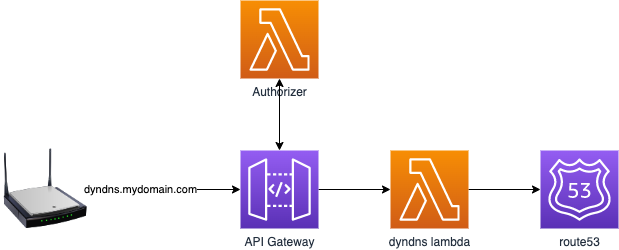

# DynDNS with AWS Route53 and Lambda

# Sample

| Hostname                    | `A` Record                                  |
|-----------------------------|---------------------------------------------|
| dyndns.mydmain.com          | `[api].execute-api.[region].amazonaws.com.` |
| home.mydmain.com            | `[dynamic ip]`                              |
| subdomain1.home.mydmain.com | `[dynamic ip]`                              |
| subdomain2.home.mydmain.com | `[dynamic ip]`                              |

## Prerequisites

* Configure AWS credentials: https://docs.aws.amazon.com/cli/latest/userguide/cli-configure-files.html
* Configure a hosted zone for your domain (e.g. mydomain.com)
* Create certificate for your domain including subdomains

### DynDNS Lambda
* Create Lambda 
* Provide environment variables:
  * `HOSTED_ZONE_ID`
* Add Permissions for Lambda execution role
  * `route53:ChangeResourceRecordSets`
  * `route53:ListResourceRecordSets`

### Authorization Lambda
* Create Lambda
* Provide environment variables:
  * `BASIC_AUTH_USERNAME`
  * `BASIC_AUTH_PASSWORD`

### API Gateway
* create API gateway with lambda proxy
* configure authenticator to method request

## Install

`npm install`

## Deploy

### Execute deployment

Adjust lambda names in `package.json` scripts

`npm run deploy`

### Test
`curl -u user:pass https://dyndns.mydomain.com/?hostname=home.mydomain.com`
